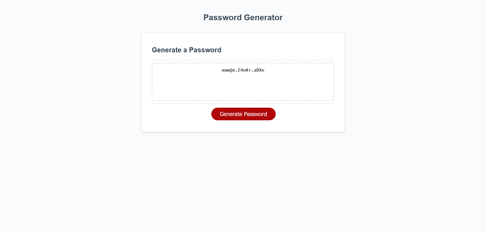

# JavaScript Random Password Generator

## Module 03 Challenge Task:
Use pre-existing html and css files and create a javascript applet to display a randomly generated password phrase base on user-defined password length and character criteria below:

- user must select a password length between 8 and 128 characters
- user can choose to include lower case letters
- user can choose to include upper case letters
- user can choose to include special characters (as defined [here](https://www.owasp.org/index.php/Password_special_characters))
- user can choose to include numbers
- user must select at least one character set above before a password can be generated
- user's input is checked to verify valid number is entered as password length

---

[Project repo on GitHub](https://github.com/X-is-For-Alex/module-03-js-password-generator)

[Live page on GitHub](https://x-is-for-alex.github.io/module-03-js-password-generator/)

---

